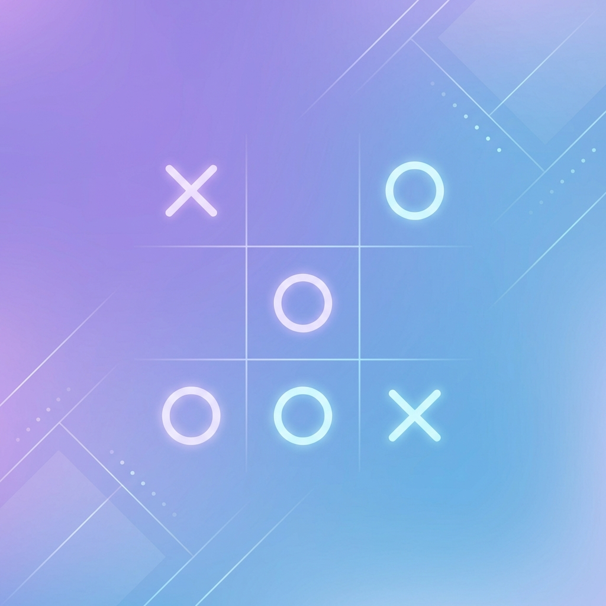

# 🎮 Tic Tac Toe Game with AI ❌⭕

A professional, fully-featured Tic Tac Toe game built with Python and Pygame, featuring an unbeatable AI powered by the Minimax algorithm.



## ✨ Features

### 🎯 Game Modes
- **Player vs Player (PvP)**: Play against a friend locally
- **Player vs AI (PvE)**: Challenge an unbeatable AI opponent

### 🧠 Artificial Intelligence
- **Minimax Algorithm**: The AI uses the classic Minimax algorithm with Alpha-Beta pruning
- **Unbeatable**: The AI plays optimally and cannot be beaten (you can only draw or lose)
- **Realistic Delay**: Small thinking delay for a more natural feel

### 🎨 Graphics & Visuals
- Beautiful gradient background
- Custom X and O symbols
- Clean, modern grid design
- Smooth visual feedback
- Game over screen with results

### 🔊 Sound & Audio
- **Move Sound**: Plays when a move is made
- **Win Sound**: Celebratory sound when someone wins
- **Draw Sound**: Sound effect for a draw
- **Voice Audio**: 
  - "You Win" voice feedback
  - "AI Wins" voice feedback
  - "Draw" voice feedback

### 🎮 Game Logic
- ✅ Complete win/draw detection
- ✅ Proper turn management
- ✅ Invalid move prevention
- ✅ Game state management
- ✅ Restart functionality (Press R)
- ✅ Return to menu (Press M)

## 📋 Requirements

- **Python 3.7+**
- **Pygame 2.0+**

## 🚀 Installation & Setup

### Step 1: Install Python

If you don't have Python installed:

**macOS/Linux:**
```bash
# Python is usually pre-installed. Check version:
python3 --version

# If not installed, download from python.org
```

**Windows:**
- Download Python from [python.org](https://www.python.org/downloads/)
- During installation, **check "Add Python to PATH"**

### Step 2: Install Pygame

Open your terminal/command prompt and run:

```bash
# Install pygame using pip
pip3 install pygame

# Or on some systems:
pip install pygame
```

To verify installation:
```bash
python3 -c "import pygame; print(pygame.version.ver)"
```

### Step 3: Download the Game

1. Download or clone this repository
2. Navigate to the game directory:
```bash
cd "Tic Tac Toe ❌⭕"
```

### Step 4: Verify Assets

Make sure the following structure exists:
```
Tic Tac Toe ❌⭕/
├── tictactoe.py          # Main game file
├── create_sounds.py      # Sound generator (optional)
├── README.md            # This file
└── assets/
    ├── x.png            # X symbol image
    ├── o.png            # O symbol image
    ├── grid.png         # Grid image
    ├── background.png   # Background image
    └── sounds/
        ├── move.wav
        ├── win.wav
        ├── draw.wav
        ├── you_win.wav
        ├── ai_wins.wav
        └── draw_voice.wav
```

All assets are already created and ready to use!

## 🎮 How to Run the Game

### Quick Start

Simply run:
```bash
python3 tictactoe.py
```

Or:
```bash
python tictactoe.py
```

### First-Time Setup Issues?

If you get an error about missing pygame:
```bash
# Install pygame first
pip3 install pygame

# Then run the game
python3 tictactoe.py
```

## 🎯 How to Play

### Starting the Game

1. Run the game
2. You'll see the main menu with two options:
   - **Player vs Player**: Play against a friend
   - **Player vs AI**: Challenge the AI

### During the Game

- **Click** on any empty cell to make your move
- **X** always goes first (Player 1)
- **O** goes second (Player 2 or AI)

### Game Over

When the game ends, you'll see:
- The result (Win/Draw)
- Press **R** to restart with the same mode
- Press **M** to return to the main menu

### Tips for Playing Against AI

- The AI is **unbeatable** - it uses perfect play
- Your best outcome is a **draw**
- Try to force a draw by:
  1. Taking the center if AI doesn't
  2. Blocking AI's winning moves
  3. Creating defensive positions

## 🧠 Understanding the Minimax Algorithm

### What is Minimax?

Minimax is a decision-making algorithm used in two-player games. Here's how it works:

1. **Game Tree**: The algorithm builds a tree of all possible game states
2. **Evaluation**: Each terminal state (win/loss/draw) gets a score:
   - AI wins: +10 points
   - Player wins: -10 points
   - Draw: 0 points
3. **Maximizing/Minimizing**: 
   - AI tries to **maximize** the score
   - Player tries to **minimize** the score
4. **Recursion**: The algorithm recursively evaluates all possible moves
5. **Best Move**: Chooses the move with the best guaranteed outcome

### Alpha-Beta Pruning

To optimize performance, the algorithm uses Alpha-Beta pruning:
- **Alpha**: Best value the maximizer (AI) can guarantee
- **Beta**: Best value the minimizer (Player) can guarantee
- Branches that won't affect the final decision are **pruned** (skipped)
- This makes the algorithm **much faster** without losing accuracy

### Code Example

```python
def minimax(self, depth, is_maximizing, alpha=-inf, beta=inf):
    # Check terminal states (win/loss/draw)
    if game_over:
        return score
    
    if is_maximizing:  # AI's turn
        max_score = -inf
        for each_possible_move:
            try_move()
            score = minimax(depth+1, False, alpha, beta)
            undo_move()
            max_score = max(max_score, score)
            alpha = max(alpha, score)
            if beta <= alpha:
                break  # Pruning
        return max_score
    else:  # Player's turn
        min_score = inf
        for each_possible_move:
            try_move()
            score = minimax(depth+1, True, alpha, beta)
            undo_move()
            min_score = min(min_score, score)
            beta = min(beta, score)
            if beta <= alpha:
                break  # Pruning
        return min_score
```

## 🎨 Customization

### Replace Sounds

You can replace the sound files with your own:

1. Record or download better sound effects
2. Replace files in `assets/sounds/` folder
3. Keep the same filenames and `.wav` format

For voice sounds, you can:
- Record your own voice
- Use text-to-speech services (e.g., Google TTS, Amazon Polly)
- Use AI voice generators

### Replace Graphics

1. Create your own images
2. Replace files in `assets/` folder
3. Recommended sizes:
   - `x.png` and `o.png`: 512x512 pixels
   - `grid.png`: 450x450 pixels
   - `background.png`: 600x700 pixels

## 🐛 Troubleshooting

### "pygame not found" Error
```bash
pip3 install pygame
```

### "No module named pygame" on macOS
```bash
python3 -m pip install pygame
```

### Sound Not Playing
- Check that sound files exist in `assets/sounds/`
- Run `python3 create_sounds.py` to regenerate sound files
- Check your system volume

### Game Window Not Appearing
- Make sure you have a display connected
- Try running with `python3 -m pygame.examples.aliens` to test pygame

### Performance Issues
- Close other applications
- Update your graphics drivers
- The game is very lightweight and should run on any modern computer

## 📝 Code Structure

```
tictactoe.py
├── Constants          # Game settings (colors, sizes, etc.)
├── GameMode          # Enumeration for game modes
└── TicTacToe Class
    ├── __init__()           # Initialize game
    ├── load_assets()        # Load images and sounds
    ├── reset_game()         # Reset game state
    ├── draw_board()         # Render game board
    ├── draw_menu()          # Render menu
    ├── draw_game_over()     # Render game over screen
    ├── make_move()          # Handle player moves
    ├── check_winner()       # Check for winner
    ├── is_board_full()      # Check for draw
    ├── minimax()            # AI algorithm
    ├── get_best_move()      # Find optimal move
    └── run()                # Main game loop
```

## 🎓 Learning Resources

To learn more about game development and AI:

- **Pygame Documentation**: [pygame.org/docs](https://www.pygame.org/docs/)
- **Minimax Algorithm**: [Wikipedia - Minimax](https://en.wikipedia.org/wiki/Minimax)
- **Alpha-Beta Pruning**: [Wikipedia - Alpha-Beta Pruning](https://en.wikipedia.org/wiki/Alpha%E2%80%93beta_pruning)
- **Python Game Development**: [Real Python - PyGame Tutorial](https://realpython.com/pygame-a-primer/)

## 📄 License

This project is created for educational purposes. Feel free to use, modify, and distribute.

## 🤝 Contributing

Suggestions and improvements are welcome! Some ideas:
- Add difficulty levels for AI
- Add online multiplayer
- Add different board sizes (4x4, 5x5)
- Add animations for moves
- Add score tracking
- Add different themes

## 👨‍💻 About

Created by a professional Python game developer to demonstrate:
- Clean, well-commented code
- Professional game structure
- AI implementation with Minimax
- Complete game loop with Pygame
- Beginner-friendly explanations

---

## 🚀 Quick Start Summary

1. **Install Python** (if needed)
2. **Install Pygame**: `pip3 install pygame`
3. **Run the game**: `python3 tictactoe.py`
4. **Enjoy!** ❌⭕

**Have fun playing!** 🎮
